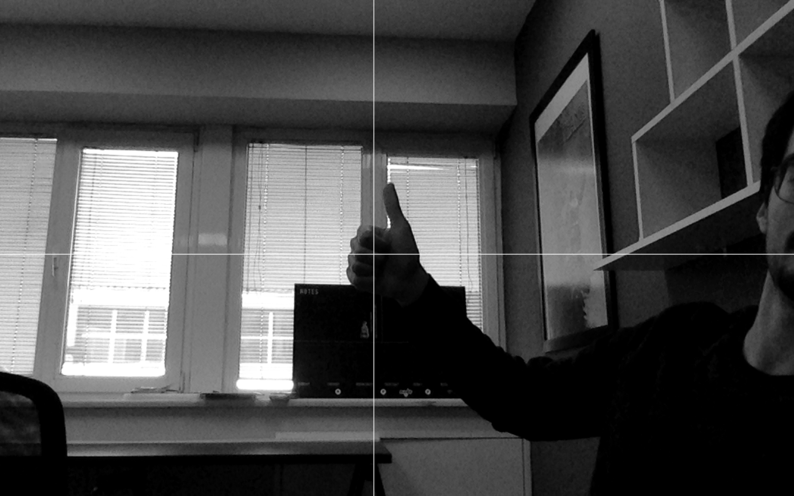

# Calibration_Video_Capture

Author: Mert Kaan Çukadar

This application will cover the topic of detect and take a photo from center
of calibration image.

>param1: 'q' --> this comman close the application. 

>param2: 's' --> if you ready to captrure the image this comman save it to your current file

before you start: 
please get your calibration image's center to intersection point's of two lines
then press 's' button to save it. After that you can close the program with 'q' button. 
    
